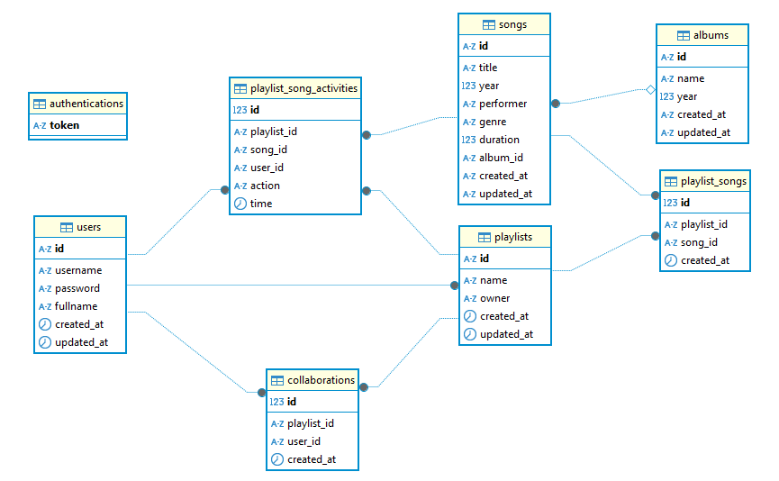

# 🗄️ Database Schema - OpenMusic API v2

Dokumentasi lengkap struktur database PostgreSQL untuk OpenMusic API v2 dengan penjelasan detail setiap tabel dan relasi.

## 📋 Daftar Isi

- [Overview](#-overview)
- [V1 Tables (Fitur Dasar)](#-v1-tables-fitur-dasar)
- [V2 Tables (Fitur Baru)](#-v2-tables-fitur-baru)
- [Entity Relationship Diagram](#-entity-relationship-diagram)
- [Database Constraints](#-database-constraints)
- [Indexes dan Performance](#-indexes-dan-performance)

## 🏗️ Overview

Database OpenMusic API v2 menggunakan PostgreSQL dengan total **8 tabel** yang terbagi menjadi:

- **2 tabel V1** (fitur dasar yang dipertahankan)
- **6 tabel V2** (fitur authentication, playlist, dan kolaborasi): `users`, `authentications`, `playlists`, `playlist_songs`, `collaborations`, `playlist_song_activities`

### Arsitektur Database

- **RDBMS:** PostgreSQL v12+
- **Migration Tool:** node-pg-migrate
- **Connection Pool:** node-postgres (pg)
- **Pattern:** Foreign Key relationships dengan CASCADE DELETE
- **ID Strategy:**
  - V1: VARCHAR(50) dengan format `{entity}-{nanoid}`
  - V2: Mixed - VARCHAR(50) untuk main entities, SERIAL untuk junction tables
- **Timestamp Strategy:**
  - V1: TEXT fields untuk created_at/updated_at
  - V2: TIMESTAMP dengan DEFAULT CURRENT_TIMESTAMP

---

## 📀 V1 Tables (Fitur Dasar)

### 1. 🎵 `albums` Table

Menyimpan data album musik dengan informasi dasar.

```sql
CREATE TABLE albums (
    id VARCHAR(50) PRIMARY KEY,
    name TEXT NOT NULL,
    year INTEGER NOT NULL,
    created_at TEXT NOT NULL,
    updated_at TEXT NOT NULL
);
```

**Struktur Field:**

| Field        | Type        | Constraint  | Deskripsi                                   |
| ------------ | ----------- | ----------- | ------------------------------------------- |
| `id`         | VARCHAR(50) | PRIMARY KEY | Unique identifier album (format: album-xxx) |
| `name`       | TEXT        | NOT NULL    | Nama album                                  |
| `year`       | INTEGER     | NOT NULL    | Tahun rilis album                           |
| `created_at` | TEXT        | NOT NULL    | Timestamp pembuatan record                  |
| `updated_at` | TEXT        | NOT NULL    | Timestamp update terakhir                   |

**Contoh Data:**

```json
{
  "id": "album-Mk8AnmCp210PwT6B",
  "name": "Viva la Vida",
  "year": 2008,
  "created_at": "2024-01-15T10:30:00Z",
  "updated_at": "2024-01-15T10:30:00Z"
}
```

### 2. 🎶 `songs` Table

Menyimpan data lagu dengan referensi ke album.

```sql
CREATE TABLE songs (
    id VARCHAR(50) PRIMARY KEY,
    title TEXT NOT NULL,
    year INTEGER NOT NULL,
    performer TEXT NOT NULL,
    genre TEXT NOT NULL,
    duration INTEGER,
    album_id VARCHAR(50),
    created_at TEXT NOT NULL,
    updated_at TEXT NOT NULL,
    FOREIGN KEY (album_id) REFERENCES albums(id) ON DELETE CASCADE
);
```

**Struktur Field:**

| Field        | Type        | Constraint  | Deskripsi                                 |
| ------------ | ----------- | ----------- | ----------------------------------------- |
| `id`         | VARCHAR(50) | PRIMARY KEY | Unique identifier lagu (format: song-xxx) |
| `title`      | TEXT        | NOT NULL    | Judul lagu                                |
| `year`       | INTEGER     | NOT NULL    | Tahun rilis lagu                          |
| `performer`  | TEXT        | NOT NULL    | Nama artis/band                           |
| `genre`      | TEXT        | NOT NULL    | Genre musik                               |
| `duration`   | INTEGER     | NULL        | Durasi lagu dalam detik                   |
| `album_id`   | VARCHAR(50) | FOREIGN KEY | Referensi ke tabel albums                 |
| `created_at` | TEXT        | NOT NULL    | Timestamp pembuatan record                |
| `updated_at` | TEXT        | NOT NULL    | Timestamp update terakhir                 |

**Relasi:**

- `album_id` → `albums.id` (Many-to-One)
- **ON DELETE CASCADE:** Jika album dihapus, semua lagu dalam album ikut terhapus

**Contoh Data:**

```json
{
  "id": "song-Qbax5Oy7L8WKf74l",
  "title": "Viva la Vida",
  "year": 2008,
  "performer": "Coldplay",
  "genre": "Alternative Rock",
  "duration": 242,
  "album_id": "album-Mk8AnmCp210PwT6B",
  "created_at": "2024-01-15T10:35:00Z",
  "updated_at": "2024-01-15T10:35:00Z"
}
```

---

## 👤 V2 Tables (Fitur Baru)

### 3. 🧑‍💼 `users` Table

Menyimpan data akun pengguna untuk authentication.

```sql
CREATE TABLE users (
    id VARCHAR(50) PRIMARY KEY,
    username VARCHAR(50) UNIQUE NOT NULL,
    password TEXT NOT NULL,
    fullname TEXT NOT NULL,
    created_at TIMESTAMP NOT NULL DEFAULT CURRENT_TIMESTAMP,
    updated_at TIMESTAMP NOT NULL DEFAULT CURRENT_TIMESTAMP
);

-- Index untuk performa
CREATE INDEX idx_users_username ON users(username);
```

**Struktur Field:**

| Field        | Type        | Constraint       | Deskripsi                                 |
| ------------ | ----------- | ---------------- | ----------------------------------------- |
| `id`         | VARCHAR(50) | PRIMARY KEY      | Unique identifier user (format: user-xxx) |
| `username`   | VARCHAR(50) | UNIQUE, NOT NULL | Username unik untuk login                 |
| `password`   | TEXT        | NOT NULL         | Password terenkripsi (bcrypt)             |
| `fullname`   | TEXT        | NOT NULL         | Nama lengkap pengguna                     |
| `created_at` | TIMESTAMP   | NOT NULL         | Timestamp pembuatan akun                  |
| `updated_at` | TIMESTAMP   | NOT NULL         | Timestamp update terakhir                 |

**Contoh Data:**

```json
{
  "id": "user-Qbax5Oy7L8WKf74l",
  "username": "johndoe",
  "password": "$2b$10$...", // bcrypt hash
  "fullname": "John Doe",
  "created_at": "2024-01-15T09:00:00.000Z",
  "updated_at": "2024-01-15T09:00:00.000Z"
}
```

### 4. 🔐 `authentications` Table

Menyimpan refresh token untuk JWT authentication.

```sql
CREATE TABLE authentications (
    token TEXT PRIMARY KEY
);
```

**Struktur Field:**

| Field   | Type | Constraint  | Deskripsi         |
| ------- | ---- | ----------- | ----------------- |
| `token` | TEXT | PRIMARY KEY | JWT refresh token |

**Fungsi:**

- Menyimpan refresh token yang valid
- Token dihapus saat logout
- Digunakan untuk refresh access token

### 5. 📝 `playlists` Table

Menyimpan data playlist milik pengguna.

```sql
CREATE TABLE playlists (
    id VARCHAR(50) PRIMARY KEY,
    name TEXT NOT NULL,
    owner VARCHAR(50) NOT NULL,
    created_at TIMESTAMP NOT NULL DEFAULT CURRENT_TIMESTAMP,
    updated_at TIMESTAMP NOT NULL DEFAULT CURRENT_TIMESTAMP,
    FOREIGN KEY (owner) REFERENCES users(id) ON DELETE CASCADE
);

-- Index untuk performa
CREATE INDEX idx_playlists_owner ON playlists(owner);
```

**Struktur Field:**

| Field        | Type        | Constraint  | Deskripsi                                         |
| ------------ | ----------- | ----------- | ------------------------------------------------- |
| `id`         | VARCHAR(50) | PRIMARY KEY | Unique identifier playlist (format: playlist-xxx) |
| `name`       | TEXT        | NOT NULL    | Nama playlist                                     |
| `owner`      | VARCHAR(50) | FOREIGN KEY | ID pemilik playlist                               |
| `created_at` | TIMESTAMP   | NOT NULL    | Timestamp pembuatan playlist                      |
| `updated_at` | TIMESTAMP   | NOT NULL    | Timestamp update terakhir                         |

**Relasi:**

- `owner` → `users.id` (Many-to-One)
- **ON DELETE CASCADE:** Jika user dihapus, semua playlist miliknya ikut terhapus

### 6. 🎵 `playlist_songs` Table

Tabel junction untuk relasi many-to-many antara playlist dan songs.

```sql
CREATE TABLE playlist_songs (
    id SERIAL PRIMARY KEY,
    playlist_id VARCHAR(50) NOT NULL,
    song_id VARCHAR(50) NOT NULL,
    created_at TIMESTAMP NOT NULL DEFAULT CURRENT_TIMESTAMP,
    FOREIGN KEY (playlist_id) REFERENCES playlists(id) ON DELETE CASCADE,
    FOREIGN KEY (song_id) REFERENCES songs(id) ON DELETE CASCADE,
    UNIQUE(playlist_id, song_id)
);

-- Indexes untuk performa
CREATE INDEX idx_playlist_songs_playlist ON playlist_songs(playlist_id);
CREATE INDEX idx_playlist_songs_song ON playlist_songs(song_id);
```

**Struktur Field:**

| Field         | Type        | Constraint  | Deskripsi                             |
| ------------- | ----------- | ----------- | ------------------------------------- |
| `id`          | SERIAL      | PRIMARY KEY | Auto-increment unique identifier      |
| `playlist_id` | VARCHAR(50) | FOREIGN KEY | ID playlist                           |
| `song_id`     | VARCHAR(50) | FOREIGN KEY | ID lagu                               |
| `created_at`  | TIMESTAMP   | NOT NULL    | Timestamp penambahan lagu ke playlist |

**Constraints:**

- **UNIQUE(playlist_id, song_id)** - Mencegah duplikasi lagu dalam playlist yang sama

**Relasi:**

- `playlist_id` → `playlists.id` (Many-to-One)
- `song_id` → `songs.id` (Many-to-One)
- **ON DELETE CASCADE:** Jika playlist/song dihapus, relasi ikut terhapus

### 7. 🤝 `collaborations` Table

Menyimpan data kolaborator playlist.

```sql
CREATE TABLE collaborations (
    id SERIAL PRIMARY KEY,
    playlist_id VARCHAR(50) NOT NULL,
    user_id VARCHAR(50) NOT NULL,
    created_at TIMESTAMP NOT NULL DEFAULT CURRENT_TIMESTAMP,
    FOREIGN KEY (playlist_id) REFERENCES playlists(id) ON DELETE CASCADE,
    FOREIGN KEY (user_id) REFERENCES users(id) ON DELETE CASCADE,
    UNIQUE(playlist_id, user_id)
);

-- Indexes untuk performa
CREATE INDEX idx_collaborations_playlist ON collaborations(playlist_id);
CREATE INDEX idx_collaborations_user ON collaborations(user_id);
```

**Struktur Field:**

| Field         | Type        | Constraint  | Deskripsi                        |
| ------------- | ----------- | ----------- | -------------------------------- |
| `id`          | SERIAL      | PRIMARY KEY | Auto-increment unique identifier |
| `playlist_id` | VARCHAR(50) | FOREIGN KEY | ID playlist yang dikolaborasi    |
| `user_id`     | VARCHAR(50) | FOREIGN KEY | ID user kolaborator              |
| `created_at`  | TIMESTAMP   | NOT NULL    | Timestamp penambahan kolaborator |

**Constraints:**

- **UNIQUE(playlist_id, user_id)** - Mencegah duplikasi kolaborator yang sama dalam playlist

**Relasi:**

- `playlist_id` → `playlists.id` (Many-to-One)
- `user_id` → `users.id` (Many-to-One)

### 8. 📊 `playlist_song_activities` Table

Menyimpan riwayat aktivitas pada playlist (audit trail).

```sql
CREATE TABLE playlist_song_activities (
    id SERIAL PRIMARY KEY,
    playlist_id VARCHAR(50) NOT NULL,
    song_id VARCHAR(50) NOT NULL,
    user_id VARCHAR(50) NOT NULL,
    action VARCHAR(50) NOT NULL,
    time TIMESTAMP NOT NULL DEFAULT CURRENT_TIMESTAMP,
    FOREIGN KEY (playlist_id) REFERENCES playlists(id) ON DELETE CASCADE,
    FOREIGN KEY (song_id) REFERENCES songs(id) ON DELETE CASCADE,
    FOREIGN KEY (user_id) REFERENCES users(id) ON DELETE CASCADE
);

-- Indexes untuk performa
CREATE INDEX idx_activities_playlist ON playlist_song_activities(playlist_id);
CREATE INDEX idx_activities_user ON playlist_song_activities(user_id);
CREATE INDEX idx_activities_time ON playlist_song_activities(time);
```

**Struktur Field:**

| Field         | Type        | Constraint  | Deskripsi                        |
| ------------- | ----------- | ----------- | -------------------------------- |
| `id`          | SERIAL      | PRIMARY KEY | Auto-increment unique identifier |
| `playlist_id` | VARCHAR(50) | FOREIGN KEY | ID playlist                      |
| `song_id`     | VARCHAR(50) | FOREIGN KEY | ID lagu                          |
| `user_id`     | VARCHAR(50) | FOREIGN KEY | ID user yang melakukan aksi      |
| `action`      | VARCHAR(50) | NOT NULL    | Jenis aksi (add/delete)          |
| `time`        | TIMESTAMP   | NOT NULL    | Waktu aktivitas (auto-generated) |

**Jenis Action:**

- `add` - Menambah lagu ke playlist
- `delete` - Menghapus lagu dari playlist

---

## 🔗 Entity Relationship Diagram



---

## ⚡ Database Constraints

### Primary Keys

- **V1 Tables**: menggunakan VARCHAR(50) sebagai primary key (albums, songs)
- **V2 Tables**:
  - `users`, `playlists`: menggunakan VARCHAR(50) sebagai primary key
  - `authentications`: menggunakan TEXT sebagai primary key (token)
  - `playlist_songs`, `collaborations`, `playlist_song_activities`: menggunakan SERIAL sebagai primary key
- Format ID untuk VARCHAR: `{entity}-{nanoid}`
- Contoh: `user-Qbax5Oy7L8WKf74l`

### Foreign Key Constraints

| Child Table                | Foreign Key   | Parent Table    | On Delete |
| -------------------------- | ------------- | --------------- | --------- |
| `songs`                    | `album_id`    | `albums(id)`    | CASCADE   |
| `playlists`                | `owner`       | `users(id)`     | CASCADE   |
| `playlist_songs`           | `playlist_id` | `playlists(id)` | CASCADE   |
| `playlist_songs`           | `song_id`     | `songs(id)`     | CASCADE   |
| `collaborations`           | `playlist_id` | `playlists(id)` | CASCADE   |
| `collaborations`           | `user_id`     | `users(id)`     | CASCADE   |
| `playlist_song_activities` | `playlist_id` | `playlists(id)` | CASCADE   |
| `playlist_song_activities` | `song_id`     | `songs(id)`     | CASCADE   |
| `playlist_song_activities` | `user_id`     | `users(id)`     | CASCADE   |

### Unique Constraints

- `users.username` - Memastikan username unik
- `authentications.token` - Primary key sekaligus unique
- `playlist_songs(playlist_id, song_id)` - Mencegah duplikasi lagu dalam playlist yang sama
- `collaborations(playlist_id, user_id)` - Mencegah duplikasi kolaborator dalam playlist yang sama

### Timestamp Fields

Semua tabel V2 memiliki timestamp tracking:

- `created_at` - Timestamp pembuatan record (TIMESTAMP dengan DEFAULT CURRENT_TIMESTAMP)
- `updated_at` - Timestamp update terakhir (khusus untuk users dan playlists)
- V1 tables menggunakan TEXT untuk timestamp fields

---

## 📈 Indexes dan Performance

### Current Indexes (dari Migration Files)

```sql
-- User indexes
CREATE INDEX idx_users_username ON users(username);

-- Playlist indexes
CREATE INDEX idx_playlists_owner ON playlists(owner);

-- Playlist songs indexes
CREATE INDEX idx_playlist_songs_playlist ON playlist_songs(playlist_id);
CREATE INDEX idx_playlist_songs_song ON playlist_songs(song_id);

-- Collaboration indexes
CREATE INDEX idx_collaborations_playlist ON collaborations(playlist_id);
CREATE INDEX idx_collaborations_user ON collaborations(user_id);

-- Activity indexes
CREATE INDEX idx_activities_playlist ON playlist_song_activities(playlist_id);
CREATE INDEX idx_activities_user ON playlist_song_activities(user_id);
CREATE INDEX idx_activities_time ON playlist_song_activities(time);
```

### Recommended Additional Indexes

```sql
-- Performance untuk pencarian lagu (tambahan yang direkomendasikan)
CREATE INDEX idx_songs_title ON songs(title);
CREATE INDEX idx_songs_performer ON songs(performer);
CREATE INDEX idx_songs_genre ON songs(genre);

-- Composite index untuk query kompleks
CREATE INDEX idx_songs_title_performer ON songs(title, performer);
CREATE INDEX idx_playlist_activities_playlist_time ON playlist_song_activities(playlist_id, time);
```

### Query Optimization Tips

1. **Gunakan LIMIT** untuk pagination pada endpoint list
2. **Index composite** untuk query yang sering digunakan bersamaan
3. **Connection pooling** untuk mengelola koneksi database
4. **Prepared statements** untuk mencegah SQL injection

---

## 🔧 Database Setup Commands

### Migration Sequence

Migrations harus dijalankan dalam urutan yang benar karena adanya foreign key dependencies:

```bash
# 1. V1 Tables (Independent)
1685000000000_create-table-albums.js
1685000000001_create-table-songs.js     # Depends on: albums

# 2. V2 Tables (Ordered by dependencies)
1749096666947_create-table-users.js     # Independent
1749097002117_create-table-authentications.js  # Independent
1749096718050_create-table-playlists.js # Depends on: users
1749096746232_create-table-playlist-songs.js   # Depends on: playlists, songs
1749096773698_create-table-collaborations.js   # Depends on: playlists, users
1749096815243_create-table-playlist-song-activities.js  # Depends on: playlists, songs, users
```

### Commands

```bash
# Test koneksi database
npm run test:db

# Jalankan semua migrations
npm run migrate:up

# Rollback migrations (development only)
npm run migrate:down

# Setup sample data untuk testing
npm run setup:sample
```

---

**💾 Database Schema** - _Struktur data yang robust dan scalable untuk OpenMusic API v2_
